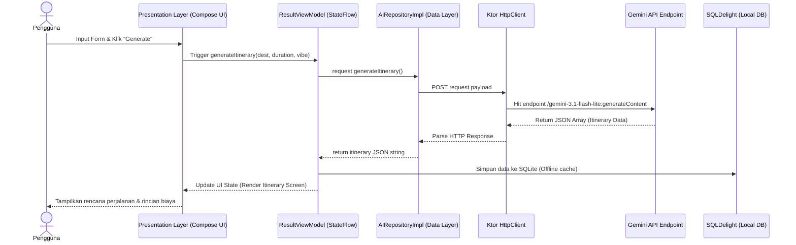

# Script Demo Video (Durasi 3 Menit) - AI Travel Planner

Dokumen ini berisi naskah (*script*) panduan perekaman video demo aplikasi **AI Travel Planner** dengan fokus utama pada alur kerja teknis (*how it works*), mulai dari input antarmuka pengguna (UI), lapisan logika bisnis (Domain/Use Cases), lapisan data (Data/Repository), hingga pemanggilan endpoint Ktor Client ke API eksternal (Google Gemini API & Wikipedia API) serta penyimpanan lokal (SQLDelight).

---

## Ringkasan Alur Sistem (System Architecture Flow)

Berikut adalah visualisasi alur data ketika pengguna merencanakan perjalanan baru di dalam aplikasi:

---

## Naskah Demo (Durasi: 3 Menit)

### Bagian 1: Pengenalan & Dashboard (0:00 - 0:30)
* **Visual di Layar:**
  - Menampilkan [Landing Screen](docs/ss_1.jpeg) (Splash/Home Dashboard).
  - Tunjukkan daftar rencana perjalanan yang sebelumnya sudah tersimpan (jika ada).
  - Presenter mengklik tombol "Mulai Perencanaan" yang membuka form input di [Planner Form](docs/ss_2.jpeg).
* **Naskah Suara (Voiceover):**
  > "Halo semuanya! Hari ini saya akan mendemonstrasikan bagaimana aplikasi **AI Travel Planner** bekerja di bawah kap sistem Kotlin Multiplatform. Aplikasi ini memandu pengguna menyusun rencana liburan secara otomatis menggunakan kecerdasan buatan, didukung oleh penyimpanan lokal yang andal dan arsitektur kode yang bersih (Clean Architecture)."
* **Detail Teknis (Under the Hood):**
  - **Screen Path:** [HomeScreen.kt](file:///d:/temp/Proyek-Pengembangan-Aplikasi-Mobile/composeApp/src/commonMain/kotlin/com/example/travelplanner/presentation/screens/home/HomeScreen.kt)
  - **Navigation Route:** `HomeRoute` berpindah ke `PlannerRoute` secara *type-safe* menggunakan Compose Navigation.

---

### Bagian 2: Pengisian Form & Pengiriman Request (0:30 - 1:15)
* **Visual di Layar:**
  - Pengguna mengisi kota tujuan: `Bali`, durasi: `3 Hari`, vibe liburan: `Healing`, serta limit budget.
  - Pengguna mengklik tombol **"Generate Itinerary"**. Layar memuat indikator animasi loading.
* **Naskah Suara (Voiceover):**
  > "Di halaman formulir ini, kita memasukkan destinasi, lama perjalanan, serta preferensi gaya liburan kita. Ketika tombol 'Generate' ditekan, antarmuka UI akan meneruskan data input ke Use Case di lapisan domain, yang kemudian mendelegasikannya ke lapisan data untuk melakukan pemanggilan API asinkron menggunakan client jaringan Ktor."
* **Detail Teknis (Under the Hood):**
  - **Screen Path:** [PlannerScreen.kt](file:///d:/temp/Proyek-Pengembangan-Aplikasi-Mobile/composeApp/src/commonMain/kotlin/com/example/travelplanner/presentation/screens/planner/PlannerScreen.kt)
  - **Use Case:** `GenerateItineraryUseCase` dipanggil oleh `ResultViewModel` untuk mengotomatisasi pemanggilan logika bisnis murni tanpa dependensi platform.

---

### Bagian 3: Proses API Jaringan Ktor & Ekstraksi AI (1:15 - 2:00)
* **Visual di Layar:**
  - Menampilkan layar [Itinerary Result](docs/ss_4.jpeg) yang menampilkan daftar rute perjalanan hari demi hari lengkap dengan ikon emoji, estimasi harga, dan tombol Google Maps.
  - Gambar latar kota Bali terisi secara dinamis di bagian atas header.
* **Naskah Suara (Voiceover):**
  > "Ktor Client melakukan request HTTP POST ke endpoint resmi Google Gemini API. Sistem mengirimkan parameter terstruktur di dalam System Prompt untuk memaksa model kecerdasan buatan membalas dalam bentuk JSON array murni tanpa pembungkus markdown. Di saat yang bersamaan, CityImageService mengirimkan request HTTP GET paralel ke Wikipedia pageimages API untuk mengambil URL foto landmark kota yang akurat."
* **Detail Teknis (Under the Hood):**
  - **Ktor POST Endpoint:**
    `https://generativelanguage.googleapis.com/v1beta/models/gemini-3.1-flash-lite:generateContent?key=$API_KEY`
  - **Request Handler:** [AIRepositoryImpl.kt](file:///d:/temp/Proyek-Pengembangan-Aplikasi-Mobile/composeApp/src/commonMain/kotlin/com/example/travelplanner/data/repository/AIRepositoryImpl.kt#L97-L123) menyusun JSON payload dan mengeksekusi request.
  - **Wikipedia GET Endpoint:**
    `https://en.wikipedia.org/w/api.php?action=query&titles={City_Name}&prop=pageimages&pithumbsize=640&format=json`
  - **Service Handler:** [CityImageService.kt](file:///d:/temp/Proyek-Pengembangan-Aplikasi-Mobile/composeApp/src/commonMain/kotlin/com/example/travelplanner/core/service/CityImageService.kt#L157-L180) mengelola cache gambar lokal dan panggilan Wikipedia API.

---

### Bagian 4: Penyimpanan Offline SQLite dengan SQLDelight (2:00 - 2:30)
* **Visual di Layar:**
  - Menampilkan [Activity Plan](docs/ss_5.jpeg).
  - Presenter mengaktifkan *Airplane Mode* (atau menjelaskan status) lalu membuka daftar "Rencana Tersimpan" di aplikasi.
  - Rencana perjalanan ke Bali yang baru dibuat tetap tampil secara instan tanpa ada tundaan jaringan.
* **Naskah Suara (Voiceover):**
  > "Setelah data itinerary diterima, ViewModel langsung menyimpannya ke dalam database SQLite lokal menggunakan SQLDelight. Hal ini menjamin bahwa seluruh perjalanan yang sudah dibuat dapat diakses kapan saja dan di mana saja secara offline secara aman, tanpa memerlukan koneksi internet aktif."
* **Detail Teknis (Under the Hood):**
  - **SQLDelight Schema:** `.sq` database schema files di folder [commonMain/sqldelight](file:///d:/temp/Proyek-Pengembangan-Aplikasi-Mobile/composeApp/src/commonMain/sqldelight).
  - **Database Driver:** `AndroidSqliteDriver` untuk Android dan `NativeSqliteDriver` untuk iOS menjembatani platform ke database engine native.

---

### Bagian 5: Asisten Pengeluaran Percakapan & Penutup (2:30 - 3:00)
* **Visual di Layar:**
  - Menampilkan [Trip Expenses](docs/ss_6.jpeg).
  - Presenter mengetik teks conversational: *"Makan siang di warung 75 ribu"* lalu menekan tombol Tambah.
  - Secara otomatis, item baru *"Makan siang"* dengan nominal `75.000` berkategori `Konsumsi` masuk ke daftar tabel pengeluaran di [Expenses List](docs/ss_7.jpeg).
* **Naskah Suara (Voiceover):**
  > "Terakhir, aplikasi memiliki fitur pencatatan pengeluaran asisten cerdas. Cukup ketik kalimat natural seperti 'Makan siang di warung 75 ribu', asisten AI mengekstrak nominal dan kategori secara otomatis, lalu SQLDelight menyimpannya secara instan ke dalam database SQLite lokal. Terima kasih, dan sampai jumpa!"
* **Detail Teknis (Under the Hood):**
  - **Ktor Parsing Request:** Memanggil method `extractExpenseFromText` di [AIRepositoryImpl.kt](file:///d:/temp/Proyek-Pengembangan-Aplikasi-Mobile/composeApp/src/commonMain/kotlin/com/example/travelplanner/data/repository/AIRepositoryImpl.kt#L52-L71) untuk mengekstrak token dari input percakapan menjadi model data SQLite.
